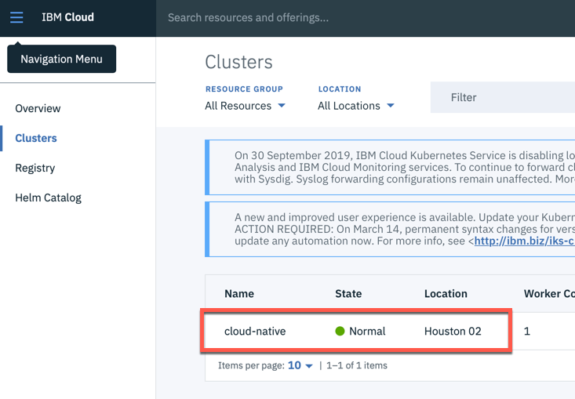

# Lab 1 - Install Prerequisites

## Required Tools

We created a Docker image you can use in that workshop.
That Docker image contains all needed CLIs such as:

- [git](https://git-scm.com/book/en/v2/Getting-Started-Installing-Git) 
- [curl](https://curl.haxx.se/download.html)
- [IBM Cloud CLI](https://cloud.ibm.com/docs/home/tools)
  [IBM Cloud CLI releases](https://github.com/IBM-Cloud/ibm-cloud-cli-release/releases)
- [Docker](https://docs.docker.com/v17.12/install/)
- [kubectl](https://kubernetes.io/docs/tasks/tools/install-kubectl/)

So, in order to complete the workshop, you **need** to install [Docker Desktop](https://docs.docker.com/install/) on your local machine. Docker Desktop is available for Mac and Windows and the Docker Engine can be run natively on [Linux](https://docs.docker.com/install/linux).

>You will work in two terminal sessions:
> * The first terminal session is for the developer focused labs 2 and 3, here you use only your **local** Docker desktop installation.
>
> * The second terminal session is for lab 4 deploy the microservice to Kubernetes, here you will work in our preconfigured Docker image using Tools - Option 1 or 2 below.


Based on our experience, Option 2 for lab 4 is the best choice for Windows users. For more background, why we provide these different options, see this [article](https://suedbroecker.net/2019/08/27/definition-of-a-dockerfile-to-use-bash-scripts-on-a-windows-10-machine-for-our-cloud-native-starter-workshop/){:target="_blank"}.


> Reminder: **The following tools options are only relevant in lab 4 the deployment to Kubernetes on IBM Cloud.** 

---

### Tools - Option 1 (prefered for Mac or Linux): Prebuilt Docker image with local Code

There is an image on DockerHub with all required tools. In order to use local IDEs and editors to modify code and configuraton files a Docker volume is used. This option works only for Mac and Linux.

In this workshop you can map the downloaded GitHub project on your  local PC to the running Docker container [using storage volumes](https://docs.docker.com/storage/volumes/){:target="_blank"}.

#### Step 1: Run these commands in a terminal

```
$ git clone https://github.com/IBM/cloud-native-starter
$ cd cloud-native-starter
$ ROOT_FOLDER=$(pwd)
$ docker run -v $ROOT_FOLDER/:/cloud-native-starter -it --rm tsuedbroecker/cns-workshop-tools:v5
```
_Note:_ With the `--rm` option in the docker run command the container is deleted once you exit. This is intended.

#### Step 2: Inside your running Docker image you can access your local GitHub project 

```
$ cd /cloud-native-starter/
$ ls
$ ROOT_FOLDER=$(pwd)
```

#### Step 3: Verfiy the tool prerequisites on for the workshop

```
$ chmod u+x iks-scripts/*.sh
$ chmod u+x scripts/*.sh
$ ./iks-scripts/check-prerequisites.sh
```

#### Step 4: Move on with [Verify Access your free Kubernetes Cluster on the IBM Cloud](./1-prereqs.md#verify-access-to-kubernetes-on-the-ibm-cloud)

---

### Tools - Option 2 (prefered for Windows): Prebuilt Image with Code in Container

There is an image on DockerHub with all required tools. This option works best for Windows. 

The following steps showing the setup using the Docker image. 

#### Step 1: Run this command in a terminal

You will start the Docker container in a interactive terminal session.

```sh
$ docker run -ti tsuedbroecker/cns-workshop-tools:v5
```

> _Note:_ If you using Windows you need to clone the project twice. You need to clone the Cloud Native Starter project to your local workstation and you will clone the project in the local running Docker container, which will run in an interactive mode.

The local project is needed for Java development labs 2 and 3, because you can't use Docker in the 'cns-workshop-tools' Docker image. (for more see this [article](https://suedbroecker.net/2019/08/27/definition-of-a-dockerfile-to-use-bash-scripts-on-a-windows-10-machine-for-our-cloud-native-starter-workshop/) ).

#### Step 2: After the container has been started, run these commands inside your running Docker image to get the lastest version of the workshop:

```
$ cd /
$ git clone https://github.com/IBM/cloud-native-starter.git
$ cd cloud-native-starter
$ ROOT_FOLDER=$(pwd)
```

#### Step 3: Verfiy the tool prerequisites on for the workshop

```
$ chmod u+x iks-scripts/*.sh
$ chmod u+x scripts/*.sh
$ ./iks-scripts/check-prerequisites.sh
```

## Verify Access to Kubernetes on the IBM Cloud

This is a preparation for lab 4, when we will connect to the IBM Cloud.

The following steps must be done in your interactive Docker container, when you use Option 1 or 2. 
If you have installed all tools on your local machine Option 3, you have to do the steps on the local machine.

#### Step 1: After you've created a new free Kubernetes cluster

1. Logon to the IBM Cloud web console

2. Select **Kubernetes** in the menu


3. Chose **Clusters** and click on your **Kubernetes cluster**



4. Follow the steps in the **Access** tab, by starting from **After your cluster provision, gain Access** and insert the commands into your terminal session.


---

__Continue with [Lab 2 - Running the Java Microservice locally](./2-docker.md#lab-2---running-the-java-microservice-locally)__ 
